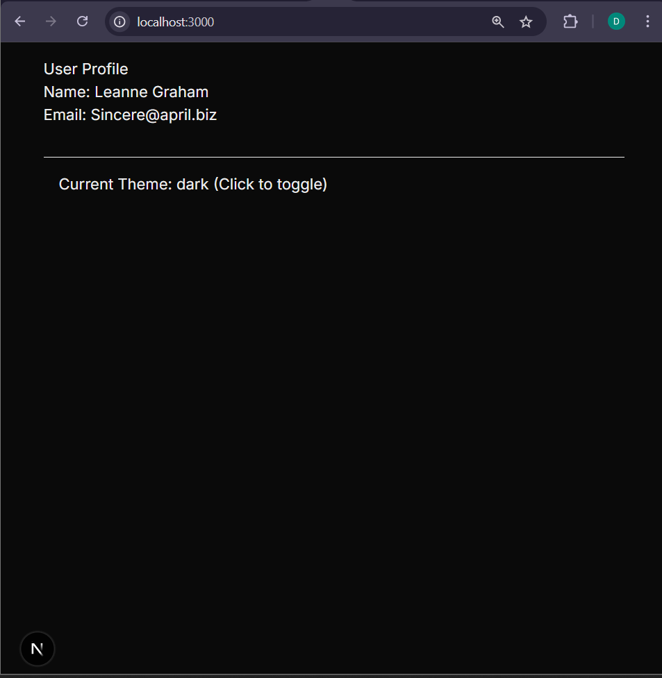

This is a [Next.js](https://nextjs.org) project bootstrapped with [`create-next-app`](https://nextjs.org/docs/app/api-reference/cli/create-next-app).

## Getting Started

First, run the development server:

```bash
npm run dev
# or
yarn dev
# or
pnpm dev
# or
bun dev
```

Open [http://localhost:3000](http://localhost:3000) with your browser to see the result.

You can start editing the page by modifying `app/page.tsx`. The page auto-updates as you edit the file.

This project uses [`next/font`](https://nextjs.org/docs/app/building-your-application/optimizing/fonts) to automatically optimize and load [Geist](https://vercel.com/font), a new font family for Vercel.

## Learn More

To learn more about Next.js, take a look at the following resources:

- [Next.js Documentation](https://nextjs.org/docs) - learn about Next.js features and API.
- [Learn Next.js](https://nextjs.org/learn) - an interactive Next.js tutorial.

You can check out [the Next.js GitHub repository](https://github.com/vercel/next.js) - your feedback and contributions are welcome!

## Deploy on Vercel

The easiest way to deploy your Next.js app is to use the [Vercel Platform](https://vercel.com/new?utm_medium=default-template&filter=next.js&utm_source=create-next-app&utm_campaign=create-next-app-readme) from the creators of Next.js.

Check out our [Next.js deployment documentation](https://nextjs.org/docs/app/building-your-application/deploying) for more details.

### Laporan Praktikum 7 State Management dalam Next.js

## Nama  : Daffa Reyhansyah Ahmad
## NIM   : 2241720195
## Kelas : TI-3C

### Praktikum 1
> 

### Praktikum 2
> 

### Praktikum 3
> 

### Praktikum 4
> 

### Praktikum 5
> 

### TUGAS 
## Bandingkan performa antara Context API, Zustand, dan Redux

- React Context API: Memiliki performa yang rendah. Ini dapat menyebabkan re-render yang tidak perlu karena semua komponen konsumen di tree akan di-render ulang ketika state dalam konteks berubah, bahkan jika mereka tidak secara langsung menggunakan state yang berubah tersebut.

- Zustand: Menawarkan performa yang lebih baik (Tinggi). Didesain sebagai library minimalis berbasis hooks, Zustand cenderung menghindari re-render yang tidak perlu dengan lebih efisien karena mengadopsi pola store dan tidak memerlukan Provider.

- Redux Toolkit: Memiliki performa medium. Meskipun Redux menyediakan single store yang dapat diprediksi, arsitekturnya yang lebih kompleks dengan konsep actions, reducers, dan store dapat memiliki sedikit overhead dibandingkan solusi yang lebih minimalis seperti Zustand. Namun, performanya dapat dioptimalkan dengan penggunaan middleware dan teknik-teknik tertentu.

## Kapan sebaiknya menggunakan masing-masing solusi

- React Context API:
Kapan digunakan: Ideal untuk state yang jarang berubah, seperti tema aplikasi atau status autentikasi (auth). Juga cocok untuk state sederhana dan ketika Anda ingin menggunakan fitur bawaan React tanpa menambahkan library eksternal.
Kapan dihindari: Tidak optimal untuk state yang sering berubah karena dapat menyebabkan re-render yang tidak perlu di seluruh component tree yang mengonsumsi context tersebut.

- Zustand:
Kapan digunakan: Pilihan yang sangat baik untuk state management yang lebih kompleks dan state yang sering berubah atau sering di-update. Cocok untuk global UI state  atau data yang membutuhkan performa lebih baik dari Context API. Karena minimalis dan tidak memerlukan provider, pengaturannya lebih sederhana.

- Redux Toolkit:
Kapan digunakan: Ideal untuk aplikasi kompleks yang membutuhkan state management yang dapat diprediksi dengan single store. Sangat bermanfaat ketika Anda memerlukan dev tools yang powerful untuk debugging dan time-travel debugging. Mendukung SSR dengan next-redux-wrapper.

-SWR/React Query:
Kapan digunakan: Khusus untuk mengelola server state atau data yang berasal dari API eksternal. Menyediakan fitur seperti caching otomatis, background refresh, optimistic updates, dan penanganan error terintegrasi. Sebaiknya gunakan SWR/React Query untuk data dari API daripada menyimpan di global state.

-URL State:
Kapan digunakan: Saat state perlu disimpan dalam query parameters URL. Ini berguna jika state tersebut perlu dibagikan melalui URL (misalnya, filter produk, parameter pencarian) dan secara otomatis akan persist saat halaman di-refresh. Diimplementasikan dengan Next.js router.